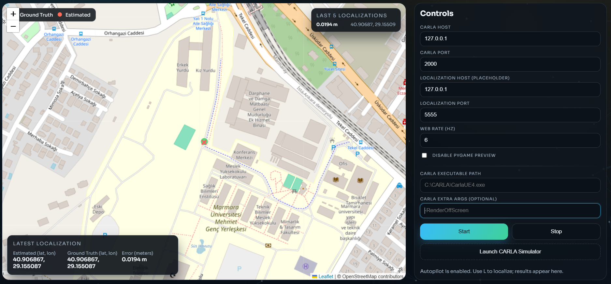
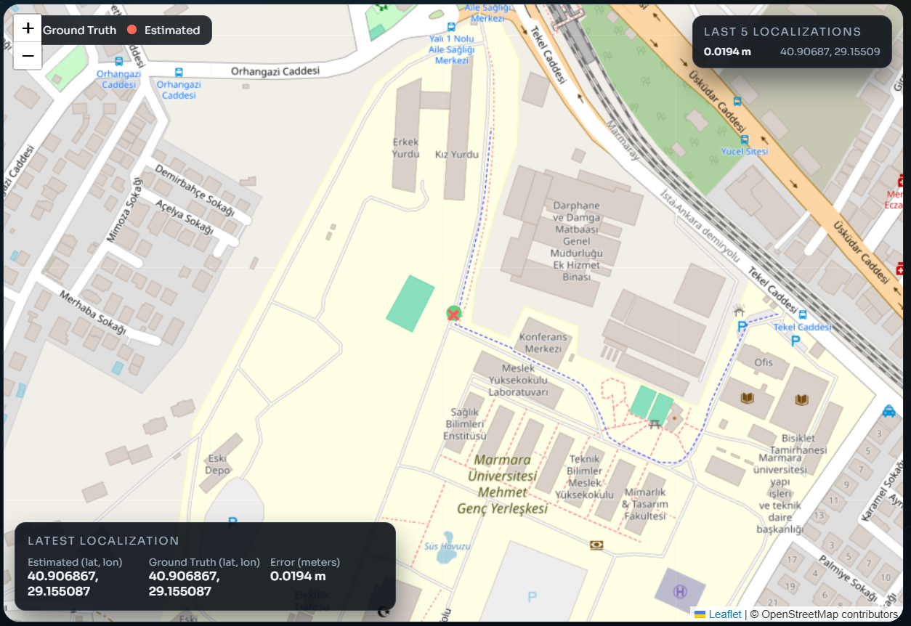
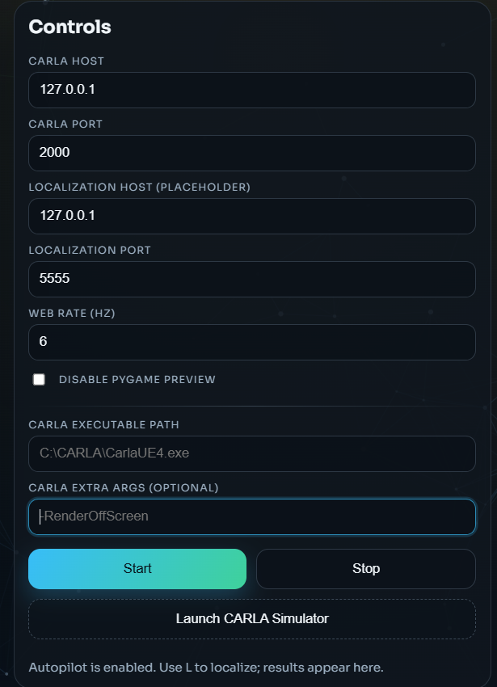

# Web Server (CARLA Visual Localization UI)

This folder contains only the web control panel. The app runs on FastAPI and serves the static UI. The web UI lets you start/stop the visual localization process and view live telemetry on a map.

The server acts as a thin orchestration layer:
- Serves the static UI (HTML/CSS/JS)
- Exposes REST endpoints to start/stop processes
- Broadcasts telemetry over WebSocket to all connected clients

## Requirements
- Python 3.9+
- CARLA and the visual localization components must be installed separately (the UI can start them if configured)

## Setup
```bash
python -m venv .venv
.venv\Scripts\activate
pip install -r web\requirements.txt
```

## Run
```bash
python web_server.py --host 127.0.0.1 --port 8000
```
Open `http://127.0.0.1:8000` in your browser.

If you want to bind on all interfaces (LAN access), use:
```bash
python web_server.py --host 0.0.0.0 --port 8000
```


## What The Website Shows
- Live OpenStreetMap view with ground-truth and estimated positions
- Latest localization details (lat/lon + error in meters)
- Last 5 localization results history
- Control panel for CARLA host/port and web rate
- Buttons to start/stop localization and launch CARLA

UI behavior highlights:
- Ground-truth is drawn as a green dot with a trail
- Estimated position is an X marker; last 5 estimates are kept on the map
- Error is computed client-side using haversine distance
- Status badge reflects process state and WebSocket connectivity





## API Summary
- `GET /` : UI page
- `GET /api/status` : Process status
- `POST /api/start` : Start visual localization
- `POST /api/stop` : Stop all processes
- `POST /api/telemetry` : Send telemetry (broadcast to UI via WS)
- `POST /api/launch-carla` : Launch CARLA simulator
- `WS /ws` : Live telemetry stream

## API Details

### `GET /api/status`
Response example:
```json
{
	"visual_localization_running": true,
	"localization_server_running": false,
	"carla_sim_running": true
}
```

### `POST /api/start`
Starts `visual_localization.py` and optionally the localization server.

Payload fields (all optional, defaults shown):
```json
{
	"start_visual": true,
	"start_localization_server": false,
	"carla_host": "127.0.0.1",
	"carla_port": 2000,
	"loc_host": "127.0.0.1",
	"loc_port": 5555,
	"web_host": "127.0.0.1",
	"web_port": 8000,
	"web_rate": 6,
	"no_preview_window": false,
	"localization_host": "0.0.0.0",
	"localization_port": 5555,
	"bundle_root": "sim-19-may-bundle"
}
```

Notes:
- `no_preview_window` disables the Pygame preview window
- `bundle_root` is used only if `start_localization_server` is true

### `POST /api/stop`
Stops all running child processes started by the web server.

### `POST /api/launch-carla`
Launches CARLA simulator with optional extra args.

Payload example:
```json
{
	"carla_exe": "C:/CARLA/CarlaUE4.exe",
	"carla_args": "-RenderOffScreen"
}
```

### `POST /api/telemetry`
Incoming telemetry is broadcast to all WebSocket clients as-is.

Web UI expects these message shapes:
```json
{ "type": "gt", "lat": 40.0, "lon": 29.0 }
```
```json
{
	"type": "localization",
	"est_lat": 40.0,
	"est_lon": 29.0,
	"gt_lat": 40.0,
	"gt_lon": 29.0
}
```
```json
{ "type": "localization_started" }
```

## Troubleshooting
- UI loads but shows "Disconnected": ensure the web server is running and reachable on the same host/port.
- Start button does nothing: check that Python can find `visual_localization.py` and its dependencies.
- CARLA does not launch: confirm the executable path and that CARLA is installed.
- WebSocket reconnect loops: verify there is no reverse proxy blocking WS upgrades.

## Notes
- The web server only provides the UI and control API.
- Visual localization and CARLA are managed by other scripts.
